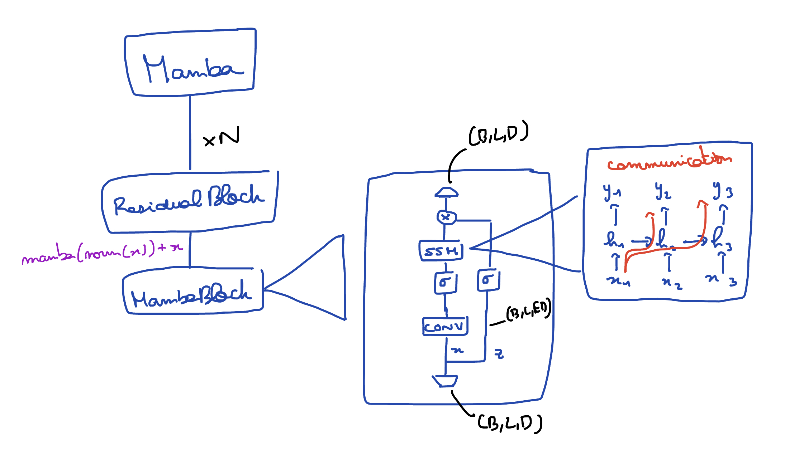
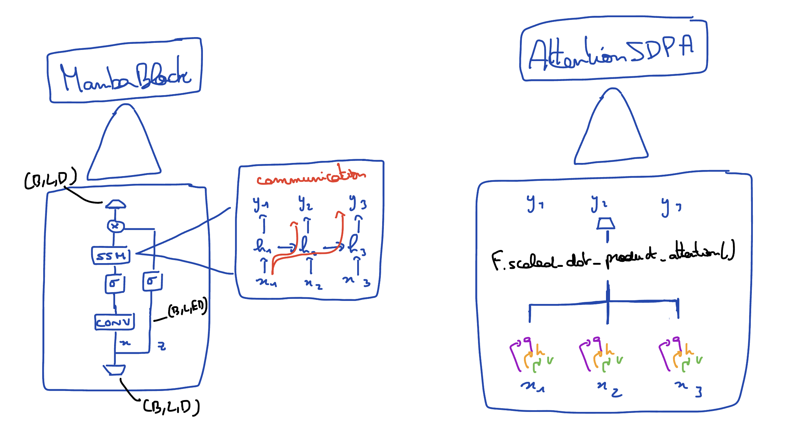
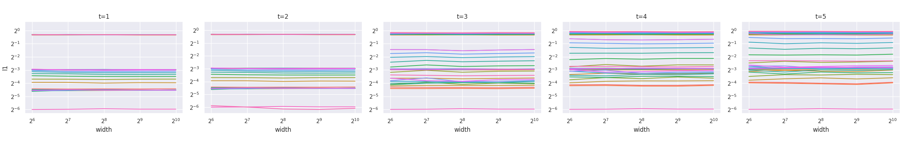
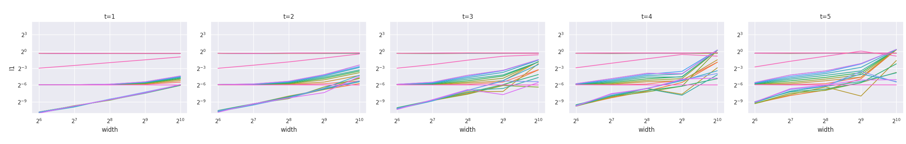
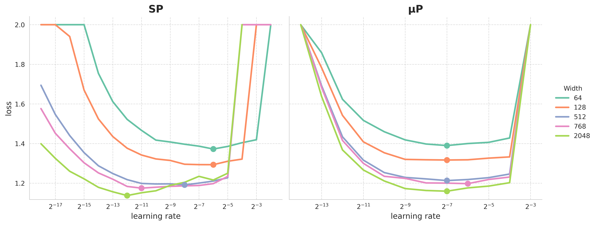

# mamba.py 🐍 : a simple and efficient Mamba implementation
A straightfoward implementation of [Mamba](https://arxiv.org/abs/2312.00752) in PyTorch with a simple parallel scan implementation, offering an major speedup over a sequential implementation, as the parallel scan allows the parallelization over the time dimension.
It combines the ease of read with good performances when training. Few other functionalities are implemented, like [Jamba](https://www.ai21.com/blog/announcing-jamba), [Vision Mamba](https://arxiv.org/abs/2401.09417) as well as [muP](https://arxiv.org/abs/2203.03466).

## Updates
- <b>03/08/2024</b> : Added a muP implementation for Mamba and Mamba2. This allows to sweep for optimal hyperparameters on a small model and directly transfer them to a large model. See [this PR](https://github.com/alxndrTL/mamba.py/pull/50)
- <b>23/07/2024</b> : `mamba.py` is now part of the transformers 🤗 library. See [this PR](https://github.com/huggingface/transformers/pull/30139).
- <b>27/06/2024</b> : Deployed a package version of `mamba.py` on PyPI, which you can install with `pip install mambapy`.

- <b>21/04/2024</b> : Added the `jamba.py` file, which implements the [Jamba](https://www.ai21.com/blog/announcing-jamba) architecture (mix of Mamba and attention layers). Also added as a possible backend the official CUDA implementation.

- <b>30/03/2024</b> : Updated inference function, now supports a custom sampling temperature and batch_size.

- <b>09/02/2024</b> : First part of the performance update. For small sequences (<128), it can speed up training by more than 20% compared to the first version. For setups close to what can found in practice (like in NLP), it can speed up training by 10%. See [this](https://github.com/alxndrTL/mamba.py/pull/12).

- <b>22/01/2024</b> : Added a MLX version of `mamba.py`, which supports inference as well as training. This version is similar to PyTorch, and allows Mac users to play around with Mamba models. It was [tested]() on the largest Mamba trained to date (2.8b)

- <b>17/01/2024</b> : Added a step function for inference. It uses the "RNN-formulation" of Mamba to greatly speed up inference.
___
## Overview


This graph shows the training time (forward and backward pass) of a single Mamba layer (`d_model=16, d_state=16`) using 3 different methods : `CUDA`, which is the official [Mamba implementation](https://github.com/state-spaces/mamba), `mamba.py`, which is this repo, and `sequential`, which is a sequential (RNN-like) implementation of the selective scan.

This repo contains a simple and readable code implementing the [Mamba](https://arxiv.org/abs/2312.00752) architecture in pure PyTorch as well as MLX. You can also play around with the Jamba model, which combines Mamba and attention layers. The primary goal of this repo is educational.

<p align="center">
    
</p>

<u>The repo is organized as follows : </u>
- `📁 mambapy` : the PyTorch implementation of Mamba
    - `pscan.py` : a PyTorch implementation of Blelloch's parallel scan
    - `mamba.py` : the Mamba model, as described in the [paper](https://arxiv.org/abs/2312.00752). It is numerically equivalent (initialization, forward and backward pass).
    - `mamba2.py` (beta) : the Mamba-2 model, as described in the [paper](https://arxiv.org/abs/2405.21060). It requieres CUDA as it is only adapted from the original version. (for now)
    - `lm.py` : encapsulates a Mamba(-2) model in order to use it as a language model
    - `jamba.py` : an implementation of the [Jamba](https://www.ai21.com/blog/announcing-jamba) model in PyTorch
    - `vim.py` : an implementation of [Vision Mamba](https://arxiv.org/abs/2401.09417).
    - `📁 onnx` : export a trained Mamba model in ONNX for inference.
- `📁 mlx` : basically the same code as above, but in MLX.
- `📁 docs` : a folder containing annotated explanations about the code, focusing on the parallel scan for now.
- `📁 examples` : two examples of how to use the Mamba model in PyTorch as well as a training file.

[muP](https://arxiv.org/abs/2203.03466) is implemented and compatible with both the Mamba models (see below for more details).

## Usage

You can either download this repo or install it with `pip install mambapy`.

The most basic usage is to use the `Mamba` object ([mamba.py](mamba.py)), which implements a simple Mamba model given a configuration.
No embedding, no head : input is `(B, L, D)` and output is `(B, L, D)` as well.

```python
import torch
from mambapy.mamba import Mamba, MambaConfig

config = MambaConfig(d_model=16, n_layers=2)
model = Mamba(config)

B, L, D = 2, 64, 16
x = torch.randn(B, L, D)
y = model(x)

assert y.shape == x.shape
```

You can also use Mamba-2 by importing the `Mamba2Config` and `Mamba2` objectfs from `mamba2.py`.


The class `LM` ([lm.py](lm.py)) builds on the `Mamba` or `Mamba-2` objects and offers a classic API for language models. It can be used as follows :

```python
from mambapy.lm import LM, MambaConfig

config = MambaConfig(d_model=16, n_layers=4) # core model
model = MambaLM(config, vocab_size=32000) # encapsulate it in a LM

x = torch.randint(high=32000, size=(16, 64))
logits = model(x) # (B, L, vocab_size)
```

It simply encapsulates a `Mamba(-2)` object with an embedding layer, a final normalization and a language modeling head.

You can use it off the shelf with a pretrained Mamba model :
```python
from mambapy.lm import from_pretrained
from transformers import AutoTokenizer

model = from_pretrained('state-spaces/mamba-130m').to("cuda")
tokenizer = AutoTokenizer.from_pretrained('EleutherAI/gpt-neox-20b')

output = model.generate(tokenizer, "Mamba is a type of")
```

This is the structure of the `mamba.py` modules:

<p align="center">
    
</p>

## Jamba
You can also train and run inference on Jamba models. Take a look at the `jamba.py` file, which constructs a `Jamba` object, which interleaves Mamba layers (from `mamba.py`) with attention layers.

This is the structure of the modules  found in `jamba.py` :

<p align="center">
    
</p>

<p align="center">
    
</p>

The API is the same as with the `Mamba` and `MambaLM` models.
You can load a pretrained Jamba model like so :

```python
from mambapy.jamba_lm import from_pretrained
from transformers import AutoTokenizer

model = from_pretrained('TechxGenus/Mini-Jamba').to("cuda")
tokenizer = AutoTokenizer.from_pretrained('TechxGenus/Mini-Jamba')

output = model.generate(tokenizer, "def min(arr):")
```

## `📁 examples`
There are two basics examples available (some may be outdated):
- `example_llm.ipynb` : load a Mamba model with pretrained weights (from 130M to 2.8B from HuggingFace)
- `example_e2e_training.ipynb` : an end-to-end training example where a Mamba model is employed as a world model for a simple 3-3 grid game (training is not completed, the model should be larger).

If you want a full training example (like in llama2.c), you can check the [othello_mamba repo](https://github.com/alxndrTL/othello_mamba) I've done. With this repo, you can train a Mamba or a Jamba from scratch, use `bfloat16`, easily swipe it with a Transformer, come up with your own data, etc ...

## muP
[muP](https://arxiv.org/abs/2203.03466) is a technique that allows to transfer hyperparameters (like the learning rate) from small to very large models. For example, it is [possible](https://arxiv.org/abs/2404.05728) to transfer (ie, use the same) the learning rate from a 2M model to a 10B model. This is extremely useful in practice when doing hyperparameters search : you just do sweeps to find the bests HPs on your small model, which is fast and inexpensive, and you automatically have the best performing HPs for your large model.

muP makes it possible by initializing and scaling the learning rates of the weights the model in a specific way. This is the result of these modifications:

<p align="center">
    
</p>

Without muP, what we get is :

<p align="center">
    
</p>

What we see here are the scale of the activations for various widths (d_model) starting at t=1 (initialization) to t=5 (5 steps of training). With SP (standard parametrization), the activations of the network are greatly vary with width, whereas they stay constant with width under muP.
And intuitively, if the activations (the "signals") of the network behave the same no matter the width, one can easily imagine that the optimal HP is thus independent of the width.

And this is what we observe in practice when we sweep for the optimal LR :

<p align="center">
    
</p>

The optimal LR shifts with bigger models under SP, whereas, with muP, it stays roughly constant. The smaller model has only 172k params, while the bigger has over 100M!

For more information about muP in general, you can take a look at the [paper](https://arxiv.org/abs/2203.03466), and to see my derivation of the muP implementation for Mamba, and what it changes concretly in code, please see the [associated PR](https://github.com/alxndrTL/mamba.py/pull/50).

___
## Performances
This section provides a more comprehensive performance comparison between `mamba.py` and the official Mamba implementation.
Overall, as the first graph of this file shows, both have approximately the same asymptotic performance with respect to the sequence length. You can think as `mamba.py` as a regular Transformer implementation, while the official Mamba implementation is more like FlashAttention v1. Both have their owns advantages.

That being said, does the two implementations have the same asymptotic performances with respect to the other parameters ?

##### `d_model` asymptotic performances
<p align="center">
    
</p>

We can see that both implementations behave the same as we increase `d_model`. The gap between the two stays roughly the same. (`mamba.py` is overall ~2x slower)

##### `d_state` asymptotic performances
<p align="center">
    
</p>

This graph is important. We see that here, the asymptotic performance is not the same as we increase `d_state`. For a reminder, `d_state`, or $N$ in the paper, is the state expansion factor : each channel of the input is expanded into $N$ channels of the hidden state.

<i>Note : the CUDA version doesn't seem to be impacted by the increase of `d_state`. This is because the benchmark was done with a batch size of 1 : the GPU was not at its full capacity and thus the impact of an increased `d_state` isn't visible. The same happens if you have a small model, or a small input length. See [this issue](https://github.com/alxndrTL/mamba.py/issues/8).</i>

Does it matter in practice ? As of now, all the pretrained Mamba models (up to 2.8B parameters) used `d_state=16`, so this change of performance over `d_state` isn't important in this case. As `d_state` is not something that is supposed to grow (contrary to the seq length or `d_model`), this isn't a catastrophic result, but something to consider.

However, it is interesting to relate this observation with the claim made by Albert Gu and Tri Dao [Mamba paper](https://arxiv.org/abs/2312.00752) : <i>The main idea is to leverage properties of modern accelerators (GPUs) to <b>materialize the state ℎ only in more efficient levels of the memory hierarchy.</b></i>
They also describe (Annex D) the main data movements of their selective scan : working mainly in SRAM, they can reduce the memory reads/writes by a factor of $O(N)$. This explains the different asymptotic behaviors that we see here.

With `d_state=16` (as in `state-spaces/mamba-2.8b-slimpj`), the gap between the two is relatively small, but with `d_state=64` (currently not used in any models), the gap widens. (note the OOM on the second graph)

<p align="center">
    
</p>

All the previous graph were computed with a batch size of 1, on a A100 80GB.
It is a measure of both the forward and backward pass of a single Mamba block.

The previous analysis showed the importance of kernel fusion, which reduces the memory accesses by $O(N)$, which makes the whole process faster.

But memory requierement should also be considered : the official Mamba implementation uses <b>recomputation</b> in the backward pass : rather than keeping in memory the activations computed during the forward pass, it simply recomputes them in the backward pass, when needed. This greatly reduces the memory requierement of the Mamba model when doing training. This is not implemented in this repo.

Hence, this repo implements one of the three techniques mentionned in the Mamba paper that form the so called "hardware-aware selective scan" : the parallel scan.
We say how kernel fusion impacts the speed while recomputation the memory requierements.

___
## Sources and where to learn more
- the [Mamba paper](https://arxiv.org/abs/2312.00752) : describes the Mamba architecture as implemented in this repo, which allows to model sequences in linear time.
- the [Mamba implementation](https://github.com/state-spaces/mamba), which is written in PyTorch but uses a parallel scan written in CUDA. This is the version that is the fastest. 
- [a minimal PyTorch implementation of Mamba](https://github.com/johnma2006/mamba-minimal), which implements the scan operation as a sequential loop (its performance are a bit worse than the 'sequential' line in the first graph). This code closely follows [this file](https://github.com/state-spaces/mamba/blob/da2626b5a5f347a8e844ac5e96a2cbcde3c34abb/mamba_ssm/modules/mamba_simple.py) from the officile Mamba implementation, but replaces the CUDA convolution with `torch.nn.Conv1d`, and the selective scan written in CUDA with a sequential loop. The code of this repo follows the structure of these 2 files.
- [Prefix Sums and Their Applications](https://www.cs.cmu.edu/~guyb/papers/Ble93.pdf), by Guy E. Blelloch (1993).
- [Parallelizing Linear Recurrent Neural Nets Over Sequence Length](https://arxiv.org/abs/1709.04057) : applies a parallel scan over the sequence in order to get rid of the sequential for-loop.
- x.com/francoisfleuret : original pscan implementation.

## TODOs
- finish docs
- Mamba 2
- clean `vim.py`
- following the performance update, update perf graph
- plot the training mem consumption of the three differents mamba imple (official, naive, mamba.py)
- pscan implementation using [ThunderKittens](https://hazyresearch.stanford.edu/blog/2024-05-12-quick-tk) ?
- ~~Jamba ? inference and/or fine-tuning ?~~
- ~~more tests with an increased `d_model` (add a Performances section)~~
- ~~a step function, used for (auto-regressive) inference.~~
- ~~a training function, similar to [llama2.c](https://github.com/karpathy/llama2.c)~~

perfs related:
- ~~unfold the for-loops in `pscan.py` to achieve better performance (see [François Fleuret's pscan](https://fleuret.org/cgi-bin/gitweb/gitweb.cgi?p=mygptrnn.git;a=blob;f=pscan.py;h=0bb0d145bf9c6c82115956c8ce1e6a063e56e747;hb=HEAD)) (although this will sacrifice readability of bit)~~
~~- write a reverse parallel scan specifically for the backward pass. (For now, we have to flip the array before and after the scan).~~
- reduce the memory usage somehow (at the cost of speed if needed)
- use torch.compile(). As far as I tested, it doesn’t work for now. It seems it isn’t happy with the custom PScan autograd function. Need to investigate. <b>(see [PR#1](https://github.com/alxndrTL/mamba.py/pull/1))</b>

## Citation

If you find this project useful in your research and wish to cite it, please use the following BibTex entry:

```
@software{mambapy,
  author = {Alexandre Torres--Leguet},
  title = {mamba.py: A simple, hackable and efficient Mamba implementation in pure PyTorch and MLX.},
  url = {https://github.com/alxndrTL/mamba.py},
  version = {1.0},
  year = {2024},
}
```
